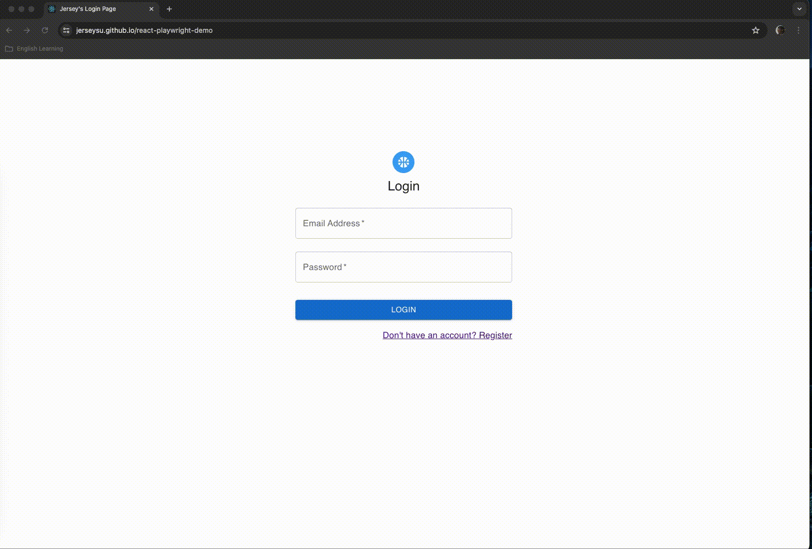

# React Playwright Demo

> This is the project to demo the playwright with the React App

[](https://github.com/jerseysu/react-playwright-demo/actions/workflows/playwright.yml)
[](https://github.com/jerseysu/react-playwright-demo/actions/workflows/pages/pages-build-deployment)


The React Playwright Demo App is based on following instruction:

React Developer Guide: [React Developer Guide](https://react.dev/)

Playwright Developer Guide: [Playwright Developer Guide](https://playwright.dev/)


Sample Login/Register App Example: [Sample Login/Register App Example](https://medium.com/@prabhashi.mm/create-a-simple-react-app-typescript-with-login-register-pages-using-create-react-app-e5c12dd6db53)

Demo Github Page: [Demo](https://jerseysu.github.io/react-playwright-demo/)



## Prerequisites

- node 20.15.1
- npm 10.7.0
- typescript 4.9.5
- react 18.3.1
- @playwright/test 1.45.1

## How to run the Demo Page

```sh
# install the dependencies
$ npm ci

# run the web server
$ npm run start
```

## Execution Test:

### Execute the Unit test

```sh
# run unit test
$ npm run test
```


### Execute the Playwright test

```sh
# run playwright test
$ npm run test:e2e
```

### Open the html test report

```sh
# run playwright report
$ npx playwright show-report
```

## Useful Sample:

- Page Object Patterns

```typescript
import { expect, type Locator, type Page } from '@playwright/test';

export class IndexPage {
  readonly page: Page;
  readonly loginButton: Locator;
  readonly email: Locator;

  constructor(page: Page) {
    this.page = page;
    this.email = page.locator('div[data-testid="email"] input');
    this.loginButton = page.locator('a[data-testid="loginButton"]');
  }

  async fillEmail() {
    await this.email.fill('Jersey@devopsday.good');
    await expect(this.email).toBeVisible();
  }

  async action() {
    await this.fillEmail();
    await this.loginButton.click();
  }
}
```

## Documentation:

Blog: - [Shift Left Testing](https://medium.com/@loverjersey/f5e87d999cd6)

## Author

Jersey Su – [@jerseysu](https://twitter.com/jersey_su)
